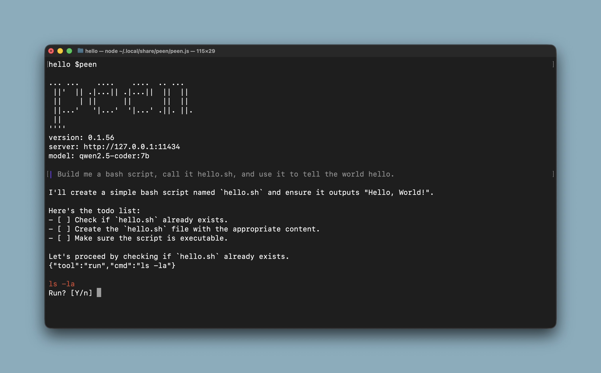

# peen

A deliberately minimalist “Claude Code / OpenCode”-style CLI written in Node.js that talks to **Ollama** over HTTP and can **run shell commands** so the model can inspect and modify your project using tools like `cat`, `ls`, `grep`, and `echo > file`. Peen was created by [Joel Dare](https://joeldare.com).



## Install

Quick install (pulls raw files from `main`, no build step):

```bash
curl -fsSL https://raw.githubusercontent.com/codazoda/peen/main/install.sh | bash
```

On each start, `peen` checks GitHub for the latest version and self-updates if needed.

## Why this exists

Popular AI tools like Claude Code, Open Code, and Codex are amazing, but the're built to work with "foundation" models that speak a very specific language (XML). I've been trying to get local, open-source models to work with these tools, but they almost always fail.

The reason is simple: local models were trained mostly on JSON, a different way of formatting data. When you try to force a local model to use the "XML language" required by big CLI tools, it gets confused. This means the most powerful feature—the ability for the AI to actually run commands for you—breaks the moment you try to run it locally.

This project is a minimal, experimental tool designed to solve that. Instead of forcing local models to speak a language they don't know, this CLI is built to understand the JSON they already use. It’s a lean "bridge" that watches the model's output, helps it fix its own mistakes, and finally makes it possible to have a capable coding assistant running right on your own machine.

## How it works

- Configure Ollama via `PEEN_HOST` (defaults to `http://127.0.0.1:11434`).
- On startup, the CLI checks that Ollama is reachable (`/api/tags`) and exits if not.
- You type a request; the assistant response streams live.
- If the model needs to inspect or edit files, it requests a tool call by outputting one-line JSON like:

```json
{"tool":"run","cmd":"ls -la"}
```

The CLI executes the command (with basic time/output limits) and sends the result back to the model.

## Configuration

Configure peen using environment variables:

| Variable | Default | Description |
|----------|---------|-------------|
| `PEEN_HOST` | `http://127.0.0.1:11434` | Ollama server URL |
| `PEEN_MODEL` | (interactive prompt) | Model to use |

### Using Ollama on a different machine

To connect to Ollama running on another machine:

```bash
export PEEN_HOST=http://192.168.1.100:11434
peen
```

### Changing the model

Set the model via environment variable:

```bash
export PEEN_MODEL=qwen2.5-coder:14b
peen
```

Or pass it as a command-line argument:

```bash
peen --model qwen2.5-coder:14b
```

## Recommended models

- qwen2.5-coder:7b
- qwen2.5-coder:14b
- qwen3-coder:30b (Requires GPU)

## Versioning

This repo uses `git rev-list --count HEAD` to produce versions like `0.1.123`.

Install the git hook once:

```bash
./scripts/install-hooks.sh
```

The hook updates:

- `package.json` version
- `VERSION` file

## Repo docs

- See **PLAN.md** for the original build plan and design constraints.
